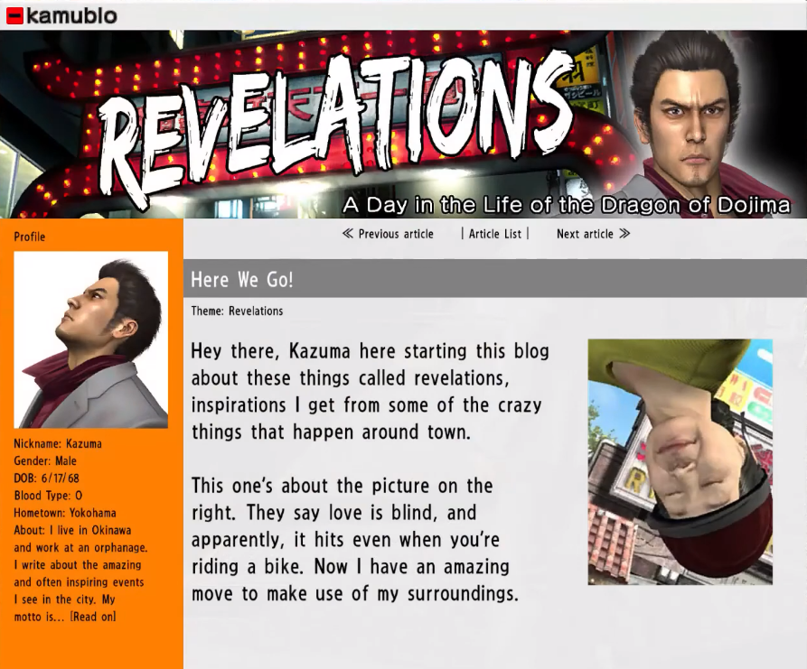

<a id="readme-top"></a>

[![Contributors][contributors-shield]][contributors-url]
[![Forks][forks-shield]][forks-url]
[![Stargazers][stars-shield]][stars-url]
[![Issues][issues-shield]][issues-url]
[![project_license][license-shield]][license-url]
[![LinkedIn][linkedin-shield]][linkedin-url]

<!-- PROJECT LOGO -->
<br />
<div align="center">
  <a href="https://github.com/MK-DlR/blog-api">
    
  </a>

<h3 align="center">Revelations</h3>

  <p align="center">
    Full-stack blog web app inspired by the Revelations system from Yakuza 3, using the in-game entries and artwork. Features a public viewer and a password-protected admin panel for managing posts.
    <br />
    <a href="https://github.com/MK-DlR/blog-api"><strong>Explore the docs »</strong></a>
    <br />
    <br />
    <a href="https://blog-api-6hg2.onrender.com/">View Demo</a>
    &middot;
    <a href="https://github.com/MK-DlR/blog-api/issues/new?labels=bug&template=bug-report---.md">Report Bug</a>
    &middot;
    <a href="https://github.com/MK-DlR/blog-api/issues/new?labels=enhancement&template=feature-request---.md">Request Feature</a>
  </p>
</div>

<!-- TABLE OF CONTENTS -->
<details>
  <summary>Table of Contents</summary>
  <ol>
    <li>
      <a href="#about-the-project">About The Project</a>
      <ul>
        <li><a href="#built-with">Built With</a></li>
      </ul>
    </li>
    <li>
      <a href="#getting-started">Getting Started</a>
      <ul>
        <li><a href="#prerequisites">Prerequisites</a></li>
        <li><a href="#installation">Installation</a></li>
        <li><a href="#notes">Notes</a></li>
      </ul>
    </li>
    <li>
      <a href="#usage">Usage</a>
      <ul>
        <li><a href="#how-to-use-the-app">How to Use the App</a></li>
        <li><a href="#default-setup-behavior">Default Setup Behavior</a></li>
      </ul>
    </li>
    <li><a href="#roadmap">Roadmap</a></li>
    <li><a href="#contributing">Contributing</a></li>
    <li><a href="#contact">Contact</a></li>
    <li><a href="#acknowledgments">Acknowledgments</a></li>
  </ol>
</details>

<!-- ABOUT THE PROJECT -->

## About The Project

[![Revelations Screen Shot][product-screenshot]](https://blog-api-6hg2.onrender.com/)

<p align="right">(<a href="#readme-top">back to top</a>)</p>

### Built With

- [![Express]][Express-url]
- [![Javascript][Javascript]][Javascript-url]
- [![Node.js]][Node-url]
- [![Postgres]][Postgres-url]
- [![Prisma]][Prisma-url]

<p align="right">(<a href="#readme-top">back to top</a>)</p>

<!-- GETTING STARTED -->

## Getting Started

To get a local copy up and running, follow these steps.

### Prerequisites

This is an example of how to list things you need to use the software and how to install them.

- Node.js (recommended v22+)
- npm
- [Neon](https://neon.tech) account (free tier works)

### Installation

1. Clone the repo
   ```sh
   git clone https://github.com/MK-DlR/blog-api.git
   ```
2. Install NPM packages
   ```sh
   cd backend
   npm install
   ```
3. Set up environment variables
   ```sh
   cp backend/.env.example backend/.env
   ```
   Open `backend/.env` and fill in your `DATABASE_URL`, `JWT_SECRET`, `ADMIN_EMAIL`, and `ADMIN_PASSWORD`.
4. Set up the database
   From the `backend` folder:
   ```sh
   npx prisma migrate dev --name init
   ```
5. Create the admin account
   Still from the `backend` folder:
   ```sh
   npm run createAdmin
   ```
   This will create the admin user using the credentials in your `.env`.
6. Start the application
   Still from the `backend` folder:
   ```sh
   node app.js
   ```
7. Open the app
   - Viewer: `http://localhost:3000`
   - Admin: `http://localhost:3000/admin`

### Notes

- Backend: Express + Prisma + PostgreSQL
- Database: Neon (cloud PostgreSQL)
- Authentication: JWT (admin only)
- Both the viewer and admin frontends are served by the Express backend
- Viewers can comment anonymously or with a name — no account required
- Only the admin account can create, edit, and delete posts

<p align="right">(<a href="#readme-top">back to top</a>)</p>

<!-- USAGE EXAMPLES -->

## Usage

This is a full-stack blog application where an admin can write and publish posts, and viewers can read them and leave comments.

The admin panel is password-protected — only the account created via the `createAdmin` script has access.

### How to Use the App

1. Open the app at http://localhost:3000 or visit the [live demo](https://blog-api-6hg2.onrender.com/)
2. Browse published posts on the viewer side
3. Click a post to read it in full
4. Leave a comment anonymously or with a name of your choice
5. To access the admin view, click the `Login` link
6. From the admin view, create, edit, publish, or delete posts

### Default Setup Behavior

- No posts are created by default — the admin creates them after setup
- The admin account is created via the `createAdmin` script using credentials from `.env`
- Viewers do not need an account to read posts or leave comments

<p align="right">(<a href="#readme-top">back to top</a>)</p>

<!-- ROADMAP -->

## Roadmap

- [ ] Admin comment management

See the [open issues](https://github.com/MK-DlR/blog-api/issues) for a full list of proposed features (and known issues).

<p align="right">(<a href="#readme-top">back to top</a>)</p>

<!-- CONTRIBUTING -->

## Contributing

As this is a student project created for The Odin Project curriculum, it is currently not open for contributions.

<p align="right">(<a href="#readme-top">back to top</a>)</p>

### Top contributors:

<a href="https://github.com/MK-DlR/blog-api/graphs/contributors">
  
</a>

<!-- CONTACT -->

## Contact

Adrien Newman - [@MK_DlR](https://twitter.com/MK_DlR) - adriennewman92@gmail.com

Project Link: [Repository](https://github.com/MK-DlR/blog-api) & [Live Demo](https://blog-api-6hg2.onrender.com/)

<p align="right">(<a href="#readme-top">back to top</a>)</p>

<!-- ACKNOWLEDGEMENTS -->

## Acknowledgements

- [The Odin Project](https://www.theodinproject.com/dashboard)
- [Font Awesome](https://fontawesome.com/)
- [Blog Icon](https://icons8.com/icon/79058/google-blog-search) by [Icons8](https://icons8.com/)
- [Favicon Converter](https://favicon.io/favicon-converter/)
- [Othneil Drew's Best README Template](https://github.com/othneildrew/Best-README-Template)
- Images, text, and styling/layout inspiration from Sega's Yakuza 3

<p align="right">(<a href="#readme-top">back to top</a>)</p>

<p align="center"></p>

<!-- MARKDOWN LINKS & IMAGES -->
<!-- https://www.markdownguide.org/basic-syntax/#reference-style-links -->

[contributors-shield]: https://img.shields.io/github/contributors/MK-DlR/blog-api.svg?style=for-the-badge
[contributors-url]: https://github.com/MK-DlR/blog-api/graphs/contributors
[forks-shield]: https://img.shields.io/github/forks/MK-DlR/blog-api.svg?style=for-the-badge
[forks-url]: https://github.com/MK-DlR/blog-api/network/members
[stars-shield]: https://img.shields.io/github/stars/MK-DlR/blog-api.svg?style=for-the-badge
[stars-url]: https://github.com/MK-DlR/blog-api/stargazers
[issues-shield]: https://img.shields.io/github/issues/MK-DlR/blog-api.svg?style=for-the-badge
[issues-url]: https://github.com/MK-DlR/blog-api/issues
[license-shield]: https://img.shields.io/github/license/MK-DlR/blog-api.svg?style=for-the-badge
[license-url]: https://github.com/MK-DlR/blog-api/blob/main/LICENSE.txt
[linkedin-shield]: https://img.shields.io/badge/-LinkedIn-black.svg?style=for-the-badge&logo=linkedin&colorB=555
[linkedin-url]: https://linkedin.com/in/adrien-newman
[product-screenshot]: images/screenshot.png

<!-- Shields.io badges. You can a comprehensive list with many more badges at: https://github.com/inttter/md-badges -->

[Angular.io]: https://img.shields.io/badge/Angular-DD0031?style=for-the-badge&logo=angular&logoColor=white
[Angular-url]: https://angular.io/
[Bootstrap.com]: https://img.shields.io/badge/Bootstrap-563D7C?style=for-the-badge&logo=bootstrap&logoColor=white
[Bootstrap-url]: https://getbootstrap.com
[EJS]: https://img.shields.io/badge/EJS-B4CA65?style=for-the-badge&logo=ejs&logoColor=fff
[EJS-url]: https://ejs.co/
[Express]: https://img.shields.io/badge/Express.js-%23404d59.svg?style=for-the-badge&logo=express&logoColor=%2361DAFB
[Express-url]: https://expressjs.com/en/
[Javascript]: https://img.shields.io/badge/JavaScript-F7DF1E?style=for-the-badge&logo=javascript&logoColor=000
[Javascript-url]: https://developer.mozilla.org/en-US/docs/Web/JavaScript
[JQuery.com]: https://img.shields.io/badge/jQuery-0769AD?style=for-the-badge&logo=jquery&logoColor=white
[JQuery-url]: https://jquery.com
[Laravel.com]: https://img.shields.io/badge/Laravel-FF2D20?style=for-the-badge&logo=laravel&logoColor=white
[Laravel-url]: https://laravel.com
[Next.js]: https://img.shields.io/badge/next.js-000000?style=for-the-badge&logo=nextdotjs&logoColor=white
[Next-url]: https://nextjs.org/
[Node.js]: https://img.shields.io/badge/Node.js-6DA55F?style=for-the-badge&logo=node.js&logoColor=white
[Node-url]: https://nodejs.org/en
[Postgres]: https://img.shields.io/badge/Postgres-%23316192.svg?style=for-the-badge&logo=postgresql&logoColor=white
[Postgres-url]: https://www.postgresql.org/
[Prisma]: https://img.shields.io/badge/Prisma-2D3748?style=for-the-badge&logo=prisma&logoColor=white
[Prisma-url]: https://www.prisma.io/
[React.js]: https://img.shields.io/badge/React-20232A?style=for-the-badge&logo=react&logoColor=61DAFB
[React-url]: https://reactjs.org/
[React-router]: https://img.shields.io/badge/React_Router-CA4245?style=for-the-badge&logo=react-router&logoColor=white
[React-router-url]: https://reactrouter.com/
[Svelte.dev]: https://img.shields.io/badge/Svelte-4A4A55?style=for-the-badge&logo=svelte&logoColor=FF3E00
[Svelte-url]: https://svelte.dev/
[Vite]: https://img.shields.io/badge/Vite-646CFF?style=for-the-badge&logo=vite&logoColor=fff
[Vite-url]: https://vite.dev/
[Vue.js]: https://img.shields.io/badge/Vue.js-35495E?style=for-the-badge&logo=vuedotjs&logoColor=4FC08D
[Vue-url]: https://vuejs.org/
